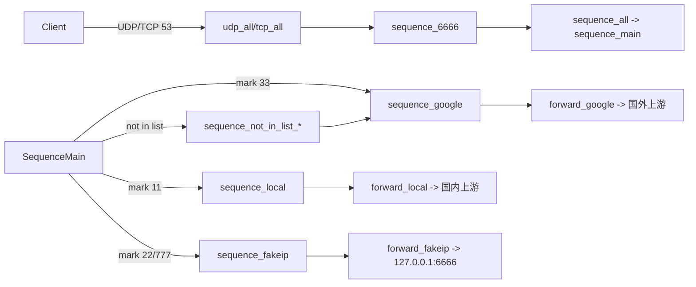
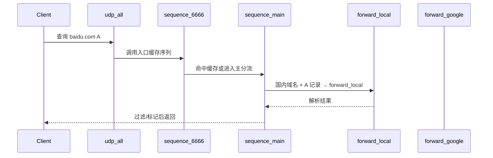

# 架构设计

## 总体架构

## 技术栈
- **CLI:** Cobra + Viper + zap，命令 `mosdns start` 提供运行入口。
- **插件:** YAML 中的 `plugins` 会注册成 `tag`，通过 `sequence`、`fallback` 等组合形成逻辑树。
- **网络:** miekg/dns 提供 UDP/TCP 服务端，forward 插件支持 DoH/DoQ、SOCKS5、ECS。
- **缓存:** 多层 cache 插件（全局/国内/国外/节点）配合 dump 文件，实现断电恢复。

## 核心流程

## 重大架构决策
| adr_id | title | date | status | affected_modules | details |
|--------|-------|------|--------|------------------|---------|
| *暂无* | - | - | - | - | - |
